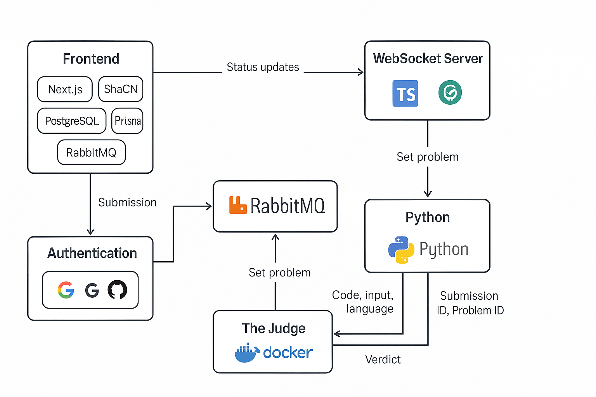
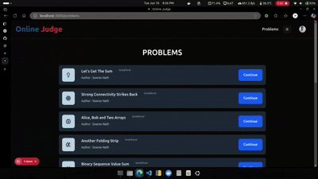

# OnlineJudge: A Modern Competitive Programming Platform


## Overview

OnlineJudge is a dynamic, full-stack web application designed to emulate the functionality of competitive programming platforms like Codeforces and LeetCode. It allows users to browse problem statements, submit code in multiple languages (C++, Python, Java, JavaScript), view real-time submission statuses, and check their submission history. Problem setters can add new problems with hidden test cases, instantly integrated into the platform. This project is a testament to my passion for building scalable, real-time systems and mastering modern development tools to create a seamless user experience.

My goal was to create a practical yet elegant system to practice and showcase my skills in a variety of technologies, from frontend frameworks to message queues and containerization. OnlineJudge is not about reinventing the wheel but about exploring how these technologies come together to solve real-world problems, fueling my curiosity to dive deeper into system design, distributed systems, and competitive programming platforms.


## Features

- **User Authentication**: Supports Google OAuth, GitHub OAuth, and manual authentication for secure access.
- **Problem Browsing**: Displays a list of problems fetched from a PostgreSQL database, with details like submission count and acceptance rate.
- **Code Submission**: Users can write code in an integrated editor or upload files, with automatic language detection.
- **Real-Time Submission Status**: WebSocket-based updates show statuses like "Queued," "Running on Test 1," "Accepted," or "Wrong Answer" in real time.
- **Submission History**: Users can view their past submissions and verdicts.
- **Problem Setting**: Authorized users can add problems with descriptions and hidden test cases, instantly available on the platform.
- **Scalable Architecture**: Handles multiple submissions concurrently using RabbitMQ queues and fanout exchanges.
- **Isolated Code Execution**: Uses Docker containers to securely execute and evaluate code against test cases.


## 🔧 Tech Stack Breakdown

| Component          | Tech Used                              | Purpose                                  |
|--------------------|--------------------------------------|------------------------------------------|
| Frontend           | Next.js, ShadCN UI, NextAuth, Prisma, PostgreSQL | UI rendering, authentication, DB access |
| Authentication     | NextAuth, Google OAuth, GitHub OAuth, Manual | Secure and flexible login                 |
| Database           | PostgreSQL                           | Stores users, problems, submissions, verdicts |
| ORM                | Prisma                              | Type-safe DB access                       |
| Messaging Queue    | RabbitMQ                           | Decoupled communication between components |
| WebSocket Server   | Node.js, TypeScript, ws            | Real-time status updates                  |
| Worker             | Python                             | Handles code execution and problem ingestion |
| Code Executor (The Judge) | Docker, bash, python          | Sandboxed multi-language code runner     |
| Container Orchestration | Docker Compose, docker-in-docker | Environment management                    |


Each technology was carefully selected to deepen my understanding of full-stack development, real-time systems, and containerization. This project allowed me to explore how these tools interact in a production-like environment, reinforcing my skills and passion for system design.


---

## Architecture

The system is divided into four major components, orchestrated to work seamlessly:

 <!-- Replace with actual diagram URL -->


## 🧠 Project Components

1️⃣ **Frontend**  
- Built with Next.js and styled using ShadCN UI  
- Code editor with auto language detection and syntax highlighting  
- Integrated with NextAuth for OAuth and manual login  
- Submission form sends code to backend, receives real-time verdicts  

2️⃣ **WebSocket Server**  
- Built using ws and Node.js in TypeScript  
- Connected clients (submitters) receive updates on submission progress  
- Publishes verdicts via RabbitMQ fanout exchange  

3️⃣ **Python Worker**  
- Pulls submissions and problem definitions from RabbitMQ queues  
- Prepares input/output, executes code using the the-judge image  
- Publishes status at each stage back to exchange for real-time updates  
- Cleans up after processing  

4️⃣ **The Judge (Docker Image)**  
- Contains execution environments for C++, Python, Java, and JavaScript  
- Accepts code, input, and language  
- Compiles/runs inside Docker-in-Docker  
- Returns granular verdicts (Accepted, WA, TLE, MLE, RE, etc.)  


---


## 📈 Workflow Overview

```plaintext
User → Auth → Problem Page → Select Problem → Code Submission
  ↓                                       ↓
DB ← Submission saved        ←     Code sent to Queue
  ↓
Worker processes → Executes with Judge → Publishes Verdict
  ↓
WebSocket server sends verdict → User sees it in real-time
```

## Demo

Below is demonstrations of key workflows:

 <!-- Replace with actual GIF URL -->


---


## Getting Started

To run OnlineJudge locally, follow these steps:

### Prerequisites

Before you begin, ensure you have the following installed on your system:

* **Docker and Docker Compose**: For containerization and running various services.
* **Node.js** (with npm): For the frontend (Next.js) and WebSocket server.
* **Python**: For the Python Worker.

### Steps

1.  **Clone the Repository**:
    First, get the project files onto your local machine.
    ```bash
    git clone https://github.com/Sowrav14/OnlineJudge.git
    cd OnlineJudge
    ```

2.  **Set Up Environment Variables**:
    Create those `.env` files in the in place of `.env.sample` files in respective directories of the project. These files will store sensitive information and configuration settings. Populate it with the necessary variables, including database connection strings, OAuth credentials, and RabbitMQ connection details as shown there.

3.  **Build The Judge Docker Image**:
    Navigate into the `the-judge` directory and build the Docker image for our code execution environment. We'll tag it as `the-judge`.
    ```bash
    cd the-judge
    docker build -t the-judge .
    cd ..
    ```

4.  **Launch All Services with Docker Compose**:
    Ensure your Docker daemon is running (e.g., Docker Desktop). From the root directory of the project, use Docker Compose to build and start all the services defined in `docker-compose.yml`. This command will handle setting up PostgreSQL, RabbitMQ, the Next.js frontend, the Node.js WebSocket server, and the Python Worker.
    ```bash
    docker-compose up --build
    ```

5.  **Access OnlineJudge**:
    Once all services are up and running, open your web browser and navigate to:
    ```
    http://localhost:3000
    ```
    You should now see the OnlineJudge landing page!


## My Journey, Passion & Future Enhancements

This project isn’t just another online judge — it’s a canvas for my learning and a testament to applying technologies I've studied in a challenging, high-level project. Building OnlineJudge from the ground up has been an incredibly rewarding experience, allowing me to dive deep into a diverse set of technologies and architect a complex, real-time system.

My passion for competitive programming, coupled with a strong desire to understand the underlying mechanisms of online judges, fueled the development of this platform. I specifically chose to integrate and explore:

* **Asynchronous Systems with RabbitMQ**: Mastering message queuing and fanout exchanges for efficient task processing and real-time status updates.
* **WebSockets for Real-time Experiences**: Building a dedicated server to provide instant feedback on submission statuses.
* **Dockerization of Isolated Environments**: Crafting "The Judge" as a secure, containerized execution environment, including the advanced use of Docker-in-Docker.
* **Database Modeling with Prisma & PostgreSQL**: Designing and managing robust data structures for problems, submissions, and user information.
* **Secure Authentication Flows with NextAuth & OAuth**: Implementing flexible and secure user authentication via manual credentials, Google, and GitHub.
* **Clean & Responsive Frontend with Next.js & ShadCN UI**: Developing a modern, performant, and aesthetically pleasing user interface.

This project has solidified my understanding of how various components of a modern web application integrate and communicate to deliver a seamless user experience. It has sparked a deeper interest in:

### Future Aspirations & Enhancements

Building upon the foundation of OnlineJudge, I am enthusiastic about continuing to learn and contribute to projects that push the boundaries of what's possible with web technologies. My future plans and areas of deep-dive exploration include:

* **Distributed Systems**: Further exploring concepts like fault tolerance, consistency, and partitioning in large-scale distributed environments.
* **Container Orchestration (Kubernetes)**: Delving deeper into Kubernetes for managing and scaling the microservices of an online judge system, ensuring high availability and efficient resource utilization.
* **Performance Optimization**: Investigating advanced techniques for optimizing code execution time, memory footprint, and overall resource utilization within the judging system.
* **Security in Sandboxed Environments**: Researching more sophisticated methods for securing code execution in untrusted environments to prevent exploits and ensure system integrity.
* **AI-Assisted Feedback**: Exploring the integration of AI to provide more insightful and personalized feedback on user submissions beyond just correctness.
* **Expanded Language Support**: Adding support for more competitive programming languages like Rust and Go.
* **Caching with Redis**: Implementing Redis for caching frequently accessed data (e.g., problem statements, common test cases) to improve performance and reduce database load.
* **CI/CD with GitHub Actions**: Setting up automated Continuous Integration and Continuous Deployment pipelines to streamline development, testing, and deployment processes.

This OnlineJudge project is just the beginning of my journey into building high-performance, resilient, and engaging software.


## Contributing

We welcome contributions to the OnlineJudge project! Whether you're fixing a bug, adding a new feature, or improving documentation, your help is appreciated.

### How to Contribute

1.  **Fork the repository**.
2.  **Create a new branch** for your feature or bug fix:
    ```bash
    git checkout -b feature/your-feature-name
    ```
    or
    ```bash
    git checkout -b bugfix/issue-description
    ```
3.  **Make your changes**. Ensure your code adheres to the project's style guidelines.
4.  **Write clear, concise commit messages**.
5.  **Push your branch** to your forked repository.
6.  **Open a Pull Request (PR)** to the `main` branch of the original repository.

### Guidelines

* **Be descriptive** in your pull request. Explain the problem your PR solves and how you've addressed it.
* **Test your changes thoroughly** before submitting a PR.
* **Respect existing code style**.
* **Be patient** during the review process.

We appreciate your effort and time in contributing to this project!


---


## 📫 Contact

If you found this project interesting or have any questions, feedback, or just want to connect, feel free to reach out!

* **💼 LinkedIn**: [[Sowrav nath](https://www.linkedin.com/in/sowrav-nath/)]
* **📧 Email**: [sowravvnath@email.com](mailto:sowravvnath@email.com)
* **🧑‍💻 GitHub**: [@Sowrav14](https://github.com/Sowrav14)

---


*Built with passion to learn, create, and inspire.*